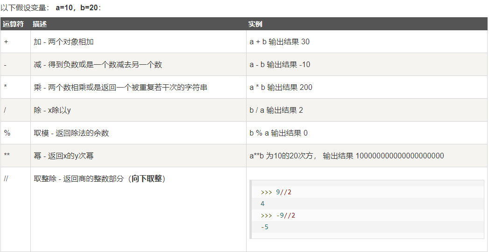
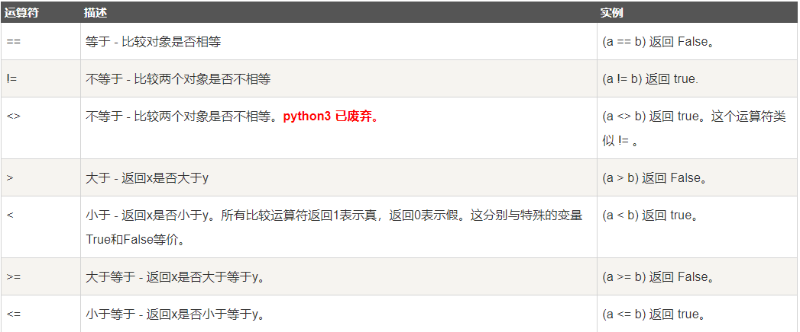
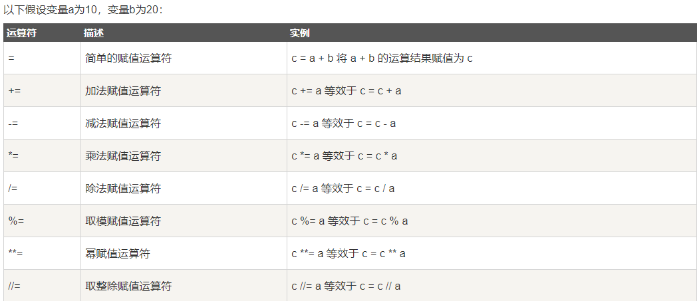
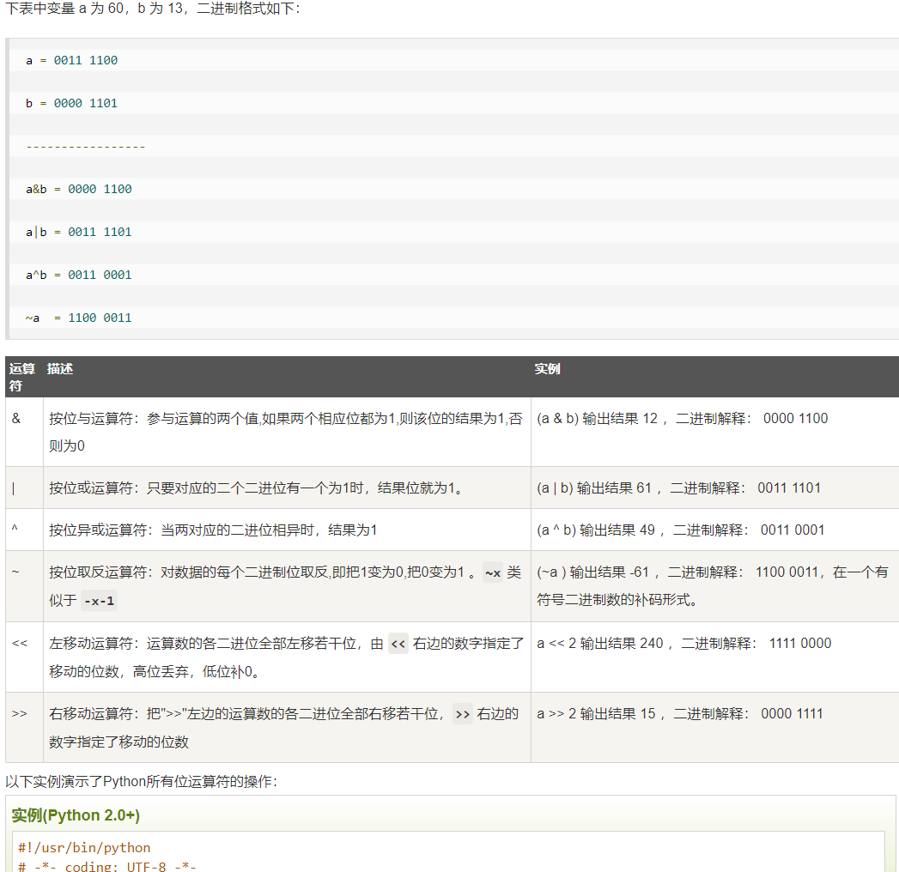
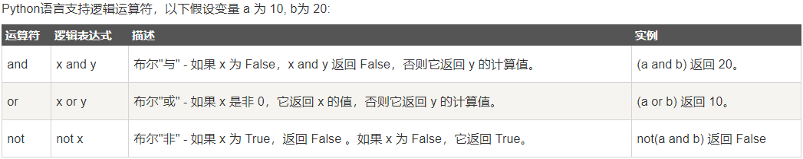
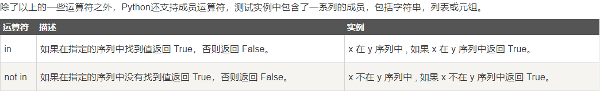
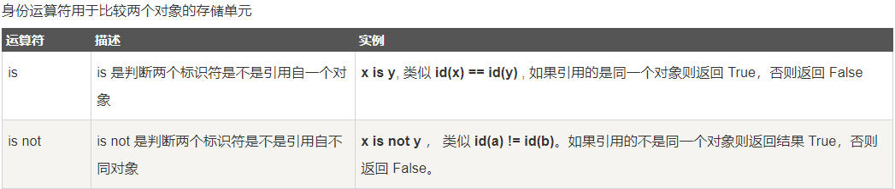
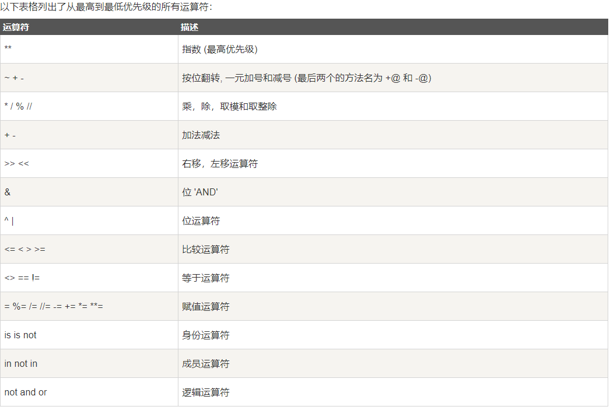

## python基本运算符

+ Python算术运算符
假设变量a为10，变量b为20：

+ Python比较运算符

+ Python赋值运算符

+ Python位运算符

+ Python逻辑运算符

+ Python成员运算符

+ Python身份运算符

+ Python运算符优先级

int(True)   --> 1
int(False)  --> 0

print(1 and 2 or 3 and 4)   2 , 4  --> 2

print(1 > 2 and 3 or 6)     3 --> 6
